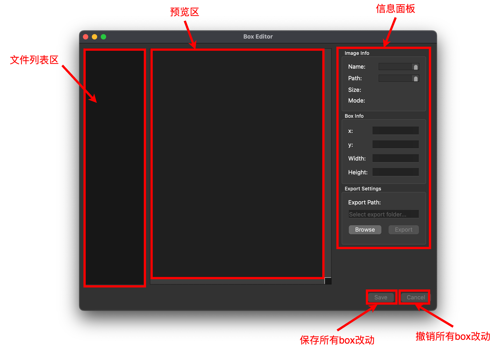
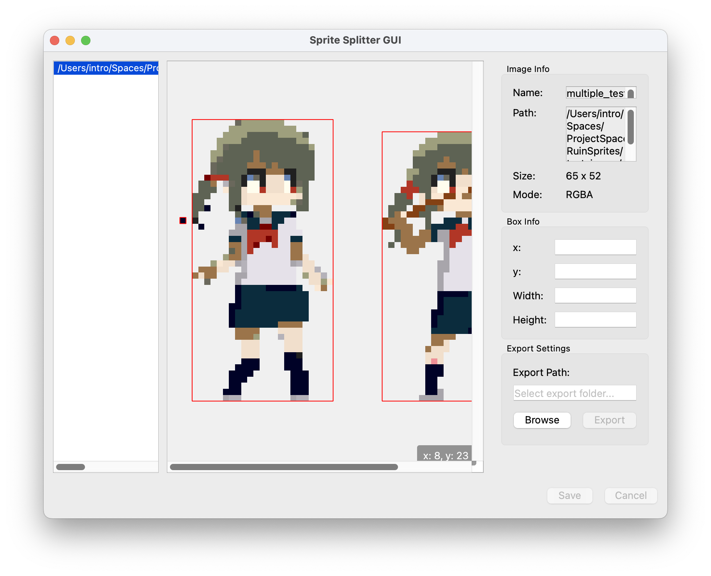

**English** | [简体中文](./usage_cn.md)

# Software Interface

When the software runs successfully, you will see the following interface:

The software consists of three areas and two buttons. Below is a detailed introduction.

## Preview Area

The preview area is responsible for displaying the results of the image loaded into the software after splitting. Each split is highlighted by a default red box. This area also displays the current position of the mouse in the bottom-right corner.

### Loading Images

You can load images by dragging and dropping image files from a folder into the preview area:

https://github.com/user-attachments/assets/79ded643-b86a-479d-9d09-8e2d01fa7b67

The preview area will open the last loaded image by default and execute the splitting algorithm on it. If the image is large, please be patient as it may take some time.

### Previewing Images

You can use the following operations to browse images in the preview area:

https://github.com/user-attachments/assets/d54c8057-16bf-47b9-898b-c85aade4bfb4

- **Zoom in/out**: Use `Ctrl + Mouse Wheel Up/Down` to zoom in or out.
- **Move the preview area**: Use `Mouse Wheel Up/Down` to move the preview area up or down, and use `Shift + Mouse Wheel Up/Down` to move it left or right.

### Modifying Split Boxes

Since the splitting algorithm makes trade-offs between performance and accuracy, there may be cases where the image is not correctly recognized:

In the image above, the hair of the character on the left is not recognized as part of the image due to gaps between pixels. We can adjust its size, and we can also press the `Delete` key to remove unnecessary boxes (areas that do not need to be split):

https://github.com/user-attachments/assets/f6987467-4b18-44a6-a1af-b1255fdf6141

## File List Area

You may have noticed that when an image is successfully loaded, a new item is added to the file list area. Its field displays the full path of the image.

When multiple images are added, you can freely select any image by clicking on its item. The algorithm will be executed the first time an image is selected. For larger images, please be patient as it may take some time:

https://github.com/user-attachments/assets/ba717a7f-52c1-45fd-ba97-fe2d0a621bb9

Each time an image is added, the file list area will automatically select the last newly loaded image. If an image is added repeatedly, the file list area will automatically select the last repeated image.

## Information Panel

Here, we display image information, selected box information, and the export folder path for sprites.

### Image Information

We display image information here, including the name, path, dimensions (width x height), and format of the image:

If the name or path cannot be fully displayed, you can use the scroll bar on the right to view the hidden content.

### Box Information

We display the selected box's top-left coordinates, width, and height here. You can modify these values by entering numbers in the corresponding fields and pressing `Enter` to confirm. If the input is valid, the box will update accordingly:

## Saving All Changes

Once all boxes are adjusted, you can click `Save` to save the current changes. When switching images, the displayed box positions will reflect the last saved state.

https://github.com/user-attachments/assets/2f2a1140-9400-40c6-a323-e9072506e83c

## Exporting Split Images

Once all boxes are adjusted, you can click `Save` to save the current changes, then click the `Browse` button to select a destination folder, and finally click `Export` to export the split images:

https://github.com/user-attachments/assets/ab16a589-2e6f-4f40-8816-df645432677a

## Discarding All Box Changes

If you are unsatisfied with the box adjustments, you can undo the last operation using `Ctrl+Z` (or `Cmd+Z` on Mac). Alternatively, you can discard all changes by switching images and clicking the `Cancel` button.
