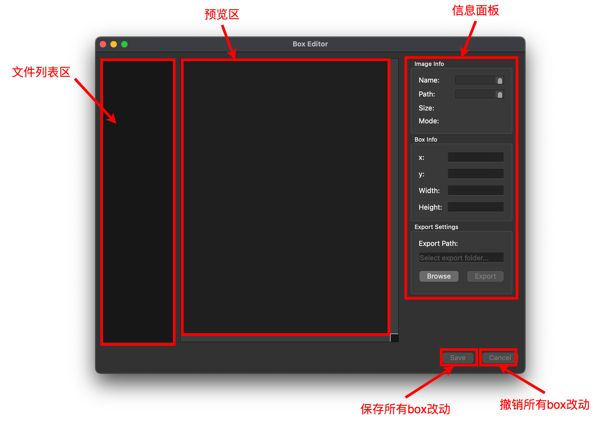
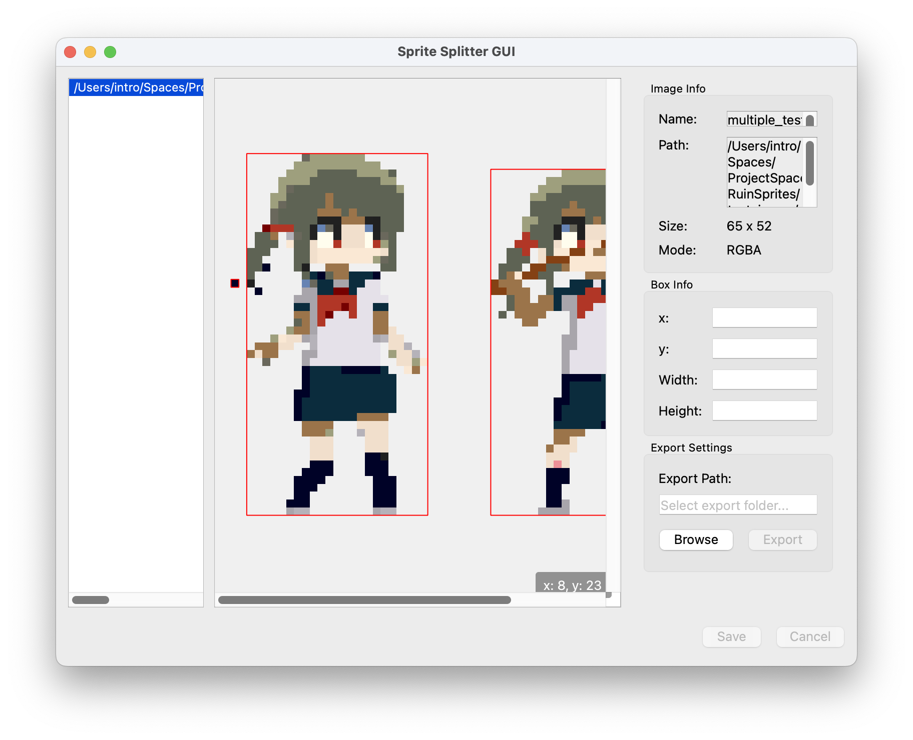
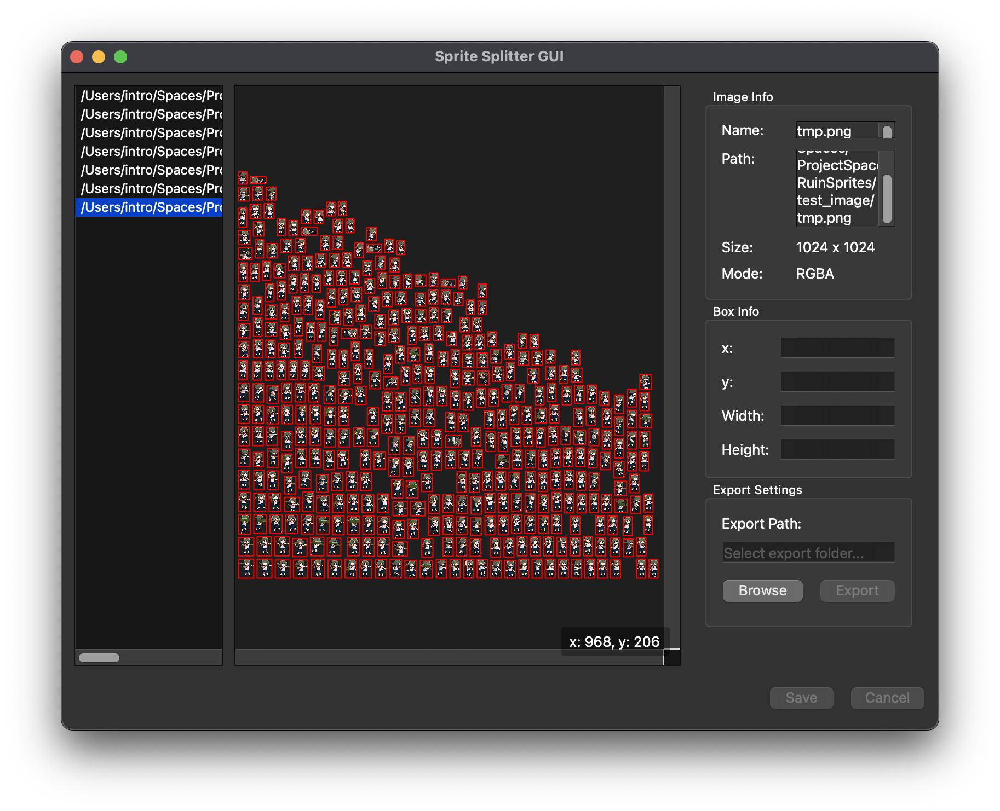
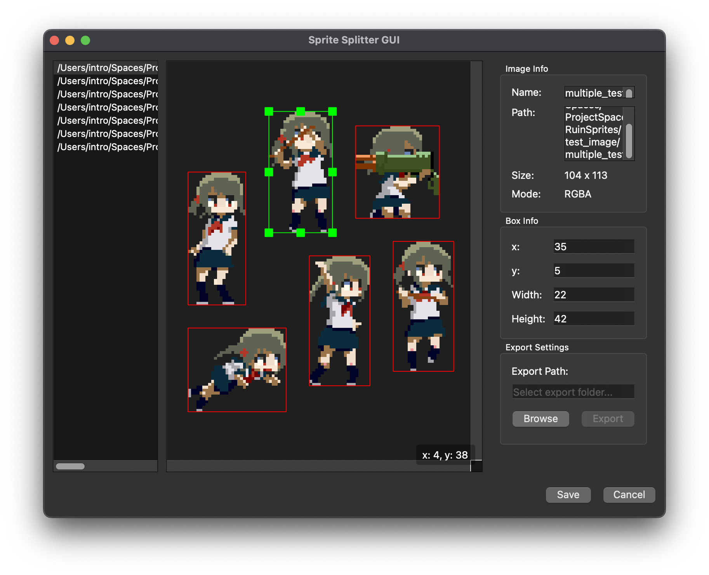

[English](./usage.md) | **简体中文**

# 软件界面

当软件运行成功后，你会看到如下界面

软件一共具备三个区域和两个按钮，下面是详细介绍

## 预览区

预览区负责显示加载到软件内的图像在切分后的结果，每一个切分都会默认使用红色的盒子圈出。这个区域也会在右下角显示鼠标在预览区内的当前位置。

### 加载图像

我们可以通过拖动文件夹内的图片文件到预览区来打开这些图片：

预览区默认会打开最后一个加载的图片，并对其进行切分算法执行，若图片较大，可能需要耐心等待一会儿。

### 预览图像

你可以在预览区使用以下操作来浏览图像：

- 缩放预览区：使用 ctrl+鼠标滚轮 Up/Down 来放大或缩小预览范围
- 移动预览区：使用 鼠标滚轮 Up/Down 来向上/向下移动预览区，使用 shift+鼠标滚轮 Up/Down 来向左/向右移动预览区

### 修改切分盒

由于切分算法做了性能和正确性的取舍，会出现无法正确识别图片的情形:

上图左侧角色的头发由于和其他像素之间有空隙，所以没有被算法识别为一个图像，我们可以对它做一些尺寸的调整，同时我们也可以按下键盘的 delete 键删除多余的盒子（不需要切分的区域）：

## 文件列表区

或许你已经注意到了，当我们成功加载一个图片之后，文件列表区会新增一个项，它的字段为该图片的完整路径。

当我们添加了多个图片后，你可以自由的通过点击任何一个项来选择一张图片，每个图片第一次被选中时，都会执行算法，对于尺寸较大的图片，会需要耐心等待一下：

每次添加图片时，文件列表区会自动选择到最后一个新加载的图片，并且重复添加图片时，文件列表区会自动选择到最后一个重复添加的图片。

## 信息面板

在这里我们会显示图片信息、被选中的 box 信息以及导出 sprites 的文件夹路径

### 图像信息

我们会在这里显示图像的信息，包括名称、路径、图片尺寸（宽 x 高）以及图片的格式：

若名称和路径无法完全显示，可以通过调整其右侧滚动条来浏览未显示的内容。

### 盒子信息

我们会在这里显示被选中的盒子，它的左上角坐标、宽度和高度。你可以标签后面输入数字来修改这些信息，并按下回车确认。如果信息合法，则盒子会响应修改。

## 存储所有改动

当所有 box 都调整完成后，我们可以点击 save 来保存当前的改动。我们切换图片时，显示的盒子位置也是上一次保存的状态。

## 导出切分后的图像

当所有 box 都调整完成后，我们可以点击 save 来保存当前的改动，然后点击 browse 按钮选择一个存放位置，然后点击 export 按钮来导出：

## 取消所有 box 的改动

当我们对 box 的调整不满意时，可以通过 ctrl+z（cmd+z on mac）来撤销一步操作，或者我们可以通过切换图片，点击 cancel 按钮的方式取消所有改动
